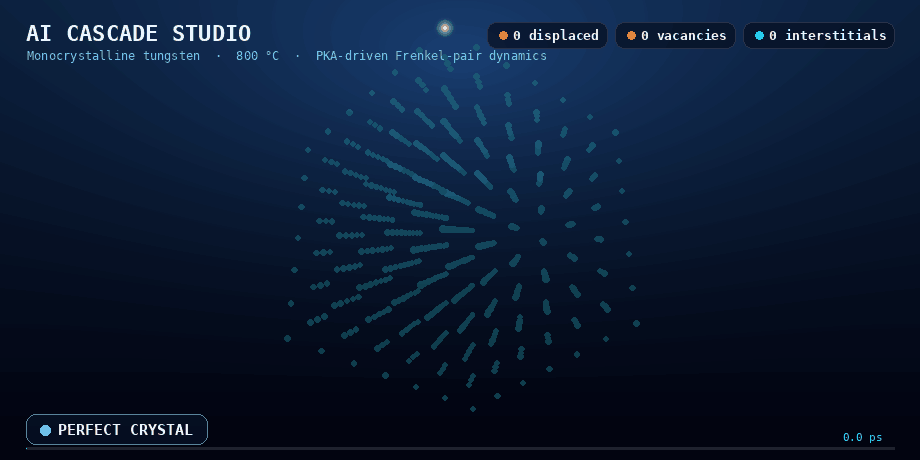

<div align="center">

# ⚛️ AI Cascade Studio

### A validated AI surrogate for displacement-cascade end states in fusion-grade tungsten — defect clouds in milliseconds, not CPU-hours on a supercomputer.

<em>Part of the <strong>Cascaide</strong> project: an AI-accelerated workflow for generating statistically representative radiation-damage cascades, built to replace repeated expensive molecular-dynamics runs inside multiscale fusion-materials models.</em>

<br/>



<br/>


</div>

---

## ✨ The 30-second pitch

When a fast neutron in a fusion reactor strikes the first wall, it kicks a lattice atom loose. That **primary knock-on atom (PKA)** tears through the crystal like a bullet through sand, scattering atoms in a few picoseconds. What it leaves behind — the surviving **vacancies** and **self-interstitial atoms (SIAs)** — is what eventually makes the metal swell, harden, and crack.

Predicting that defect debris normally means an expensive **molecular-dynamics (MD)** cascade simulation for *every single event* — and a multiscale damage model needs thousands of them. **Cascade Studio learns the statistical distribution of cascade end states and samples a brand-new, physically-faithful defect cloud in milliseconds**, then lets you fly through it in 3D, browse a statistical ensemble, read off its geometry, and export it straight into your downstream toolchain.

> 🎯 **Energy in → a full 3D defect cloud out.** No 40 ps relaxation run. No million-atom box. Just sample, inspect, export — fast enough to feed defect-evolution models at scale.

---

## 🛰️ About the Cascaide project

**Predictive simulation of radiation damage in fusion materials** has to connect three scales: energetic PKA events, picosecond-scale defect production, and long-time microstructural evolution. MD gives a physically detailed picture of displacement cascades, but the cost of sampling cascade outcomes across many events makes it impractical to use directly inside multiscale workflows.

**Cascaide** — a recently funded effort under the **American Science Cloud**, in collaboration with the **UK Atomic Energy Authority (UKAEA)** — tackles exactly this bottleneck. The goal is an **AI-accelerated workflow that produces statistically representative radiation-damage cascade end states**, replacing repeated expensive MD calculations with **fast, validated surrogate sampling** suitable for downstream defect-evolution models. This repository is the generative model and interactive studio at the heart of that workflow.

---

## 🗄️ The dataset

The surrogate is trained on a large, high-fidelity dataset of displacement cascades in **pure monocrystalline tungsten at 800 °C**, generated with **LAMMPS on the Aurora supercomputer at the Argonne Leadership Computing Facility (ALCF)**.

| | |
|---|---|
| **Simulations** | 7,100 displacement cascades |
| **PKA energy range** | 0–300 keV (sampled uniformly over subintervals) |
| **Material / temperature** | Monocrystalline tungsten (W) at 800 °C |
| **Interatomic potential** | Embedded-atom model (EAM), Chen potential |
| **MD physics** | Adaptive timestepping · electronic stopping · thermostatted boundary regions |
| **Cascade evolution time** | 40 ps, followed by energy minimization |
| **System size** | ~125,000 atoms (low energy) → 44,000,000 atoms (highest energy) |
| **Raw atomistic data** | several TB |
| **Defect-centric dataset** | **255 MB** after Wigner–Seitz analysis |

After each 40 ps cascade, an **energy minimization** removes thermal noise and sharpens defect identification. **Wigner–Seitz defect analysis** in **OVITO** on the minimized end states then extracts only the vacancies and SIAs. This defect-centric representation compresses several **terabytes** of atomistic data down to **255 MB** while preserving the cascade morphology that higher-scale models actually need — yielding an **energy-resolved statistical description of defect production, clustering, and spatial structure** across a fusion-relevant PKA energy range.

> The model learns the **minimized cascade end state** — the surviving defect population — because that is precisely what drives long-term material degradation.

---

## 🔬 The physics, briefly

A collision cascade is a story in a handful of acts — the same arc you see looping in the animation above:

| Phase | What's happening | ~Time |
|-------|------------------|-------|
| 🟦 **Perfect crystal** | The undisturbed tungsten BCC lattice. | 0 ps |
| 🟧 **Ballistic** | The PKA recoils, knocking atoms off their sites in a chain of collisions. | ~0.1 ps |
| 🟥 **Thermal spike** | A molten, super-heated core — peak disorder. | ~0.2–1 ps |
| 🟨 **Recombination** | Most displaced atoms snap back home as the spike cools. | ~1–40 ps |
| 🟦 **Surviving defects** | What's left after minimization: **Frenkel pairs** — red **vacancies** and cyan **SIAs**. | end state |

Under defect conservation, surviving vacancies and interstitials are produced together as **Frenkel pairs** (`n_vac ≈ n_sia`), so the model generates them in matched pairs.

---

## 🧠 How the model works

At its heart is a **conditional set-diffusion model** — a denoising diffusion model that generates an *unordered set of 3D points* (the defects) rather than pixels on a grid. Two cooperating networks do the work:

```
                   PKA energy (keV)
                         │
              ┌──────────┴───────────┐
              ▼                      ▼
        ┌───────────┐         ┌──────────────────┐
        │ CountHead │         │   SetDenoiser     │
        │   (MLP)   │         │ (Diffusion Trans- │
        │           │         │  former / DiT)    │
        │ energy →  │  N      │                   │
        │ log-normal├────────▶│ denoise 2·N points│
        │ over      │ pairs   │ over 1000 steps   │
        │ N_pairs   │         │ (vac + SIA)       │
        └───────────┘         └─────────┬─────────┘
                                        ▼
                              de-normalize → absolute
                              Ångström coordinates
                                        ▼
                          🎲 one stochastic cascade end state
```

**1. CountHead — "how much damage?"**
A compact MLP that maps PKA energy to a **log-normal distribution over the number of Frenkel pairs**. Higher energy → heavier-tailed, larger cascades. Sampling this head first gives each generated cascade a realistic, energy-appropriate defect count consistent with the 0–300 keV dataset.

**2. SetDenoiser — "where do they go?"**
A **Diffusion Transformer (DiT)** with `adaLN-Zero` conditioning. Multi-head self-attention over the point set makes it **permutation-equivariant** — it treats the defects as a true set, not a sequence. It is conditioned on both the diffusion timestep and the PKA energy and learns to predict the noise (ε) at each reverse step. A small **type embedding** tells each point whether it's a vacancy or an interstitial.

**3. CoordDiffusion — the DDPM engine.**
Standard denoising diffusion: `T = 1000` steps, cosine β-schedule. Generation runs the full reverse chain on Gaussian noise, then a `CoordNormalizer` (per-axis 99th-percentile scaling about the cascade centroid) maps the result back to **absolute box coordinates in Ångström**.

| Default config | Value |
|---|---|
| Model dim / depth / heads | `256` / `6` / `8` |
| Diffusion steps `T` | `1000` (cosine) |
| Energy divisor | `300.0` |
| Count cap | `1300` pairs |
| Trained / validated material | Monocrystalline tungsten @ 800 °C |

The training pipeline reads the real Wigner–Seitz vacancy/SIA dumps (via OVITO) and falls back to a physically-tuned synthetic dataset when none are present, so the full **train → infer → visualize → export** loop runs end-to-end out of the box.

---

## 🎛️ The Studio

A single self-contained WebGL app (Three.js) with **two tabs** — and it never goes dark: if the backend isn't reachable, an in-browser preview engine takes over.

### 🖥️ Dashboard — *watch the cascade happen*
A cinematic, time-resolved reconstruction of one cascade across its physical phases, with a live "displaced atoms vs. time" curve, defect counters, and a phase indicator. Scrub the 0 → 40 ps timeline, toggle bonds / cages, or just hit play.

### 🌌 Simulation — *explore the defect universe*
- **Generation controls** — PKA energy (`0.014 – 299.782 keV`, matching the dataset), temperature, material, and ensemble size (1–64 samples).
- **Interactive 3D cloud** — orbit, perspective/top/front/side presets, auto-spin, draggable repositioning, and an "inside → out" reveal animation.
- **Ensemble browser** — step through every stochastic sample with mean ± sd statistics.
- **Cascade metrics** — gyration radius *R*<sub>g</sub>, bounding extent, vacancy–SIA centroid separation, and connected-cluster count.
- **Multi-axis projections** — VAC/SIA × XY/XZ side panels.
- **Render layers** — spheres, glow cloud, convex hulls, skeleton, halo, analysis overlays.
- **One-click export** — download `00N_vac.dump` / `00N_sia.dump` pairs as a zip.

> The trained checkpoint and validated science target **tungsten**; the material selector (W / Fe / Ni) exposes the broader interface for future extensions of the workflow.

---

## 🚀 Quickstart

### 1. Install dependencies
```bash
pip install -r requirements.txt
```

### 2. Run with the trained model
```bash
python app.py --ckpt best_model.pt --port 8001
```
Then open **http://localhost:8001**.

### 3. No GPU / no checkpoint? Run the demo engine
A numpy-only, physically-plausible stand-in — no `torch` required — so the UI, export, and viewer loop all work immediately:
```bash
python app.py --demo --port 8001
```

---

## 🧪 Command-line inference & export

Generate ensembles and export to your favorite format with `inference.py`:

```bash
# Energy sweep across the fusion-relevant range, 16 samples each
python inference.py --ckpt best_model.pt --sweep 10,50,100,200 \
                    --ensemble 16 --formats json,xyz,dump,csv --out exports

# Single energy
python inference.py --ckpt best_model.pt --energy 75 --ensemble 8 --out exports

# No checkpoint? Synthesize a plausible ensemble (numpy only)
python inference.py --demo --energy 100 --ensemble 12 --out exports
```

Each run also writes per-energy ensemble statistics and a `manifest.json` you can load straight into the viewer.

---

## 🔌 API

The FastAPI backend exposes a tiny, friendly surface:

| Method | Endpoint | Purpose |
|--------|----------|---------|
| `POST` | `/api/generate` | Run the model `n_samples` times; returns clouds in absolute Ångström + per-sample stats, and writes dumps to disk. |
| `POST` | `/api/export` | Zip `00N_vac.dump` / `00N_sia.dump` pairs and stream them back. |
| `GET`  | `/api/health` | Reports whether the engine is `model` or `demo`. |
| `GET`  | `/` | Serves the Studio UI. |

<details>
<summary><strong>Example: <code>POST /api/generate</code></strong></summary>

```json
{
  "energy_keV": 100,
  "temperature": 800,
  "material": "W",
  "n_samples": 8
}
```
Returns a `cascade_cloud_v1` payload: per-member `vac`/`sia` coordinate lists, geometric stats, and aggregate ensemble statistics (defect-count distribution, mean *R*<sub>g</sub>, vac–SIA separation, …).
</details>

---

## 📦 Output formats

All coordinates are reported in **absolute box coordinates, Ångström** (never recentred):

- **JSON** (`cascade_cloud_v1`) — full ensemble + statistics, ready for the viewer.
- **LAMMPS dump** — separate `vac` / `sia` files sharing one box, for direct ingestion by MD / higher-scale models.
- **Extended XYZ** — `V` / `I` species with energy & frame metadata.
- **CSV** — flat `type,x,y,z` for quick analysis in pandas.

---

## 🗂️ Project structure

```
Cascaide_Studio/
├── app.py                  # FastAPI server: inference engine + REST + UI host
├── inference.py            # CLI: ensembles, energy sweeps, multi-format export
├── set_diffusion_pairs.py  # Model: CountHead + SetDenoiser (DiT) + CoordDiffusion + training
├── cascade_studio.html     # The WebGL Studio (Dashboard + Simulation tabs)
├── best_model.pt           # Trained checkpoint (tungsten, 0–300 keV)
├── requirements.txt        # numpy · matplotlib · fastapi · uvicorn · torch
└── cascade_demo.gif        # The animation above
```

---

## 🛣️ Roadmap

- Validation dashboards comparing surrogate output against MD ground-truth distributions (defect counts, *R*<sub>g</sub>, cluster-size statistics) across the energy range.
- Temperature- and material-conditioning baked into the generator to extend beyond the tungsten / 800 °C training regime.
- Classifier-free guidance for sharper energy control.
- Direct coupling into downstream defect-evolution / cluster-dynamics models in the Cascaide multiscale pipeline.

---

## 🙌 Acknowledgments

High-fidelity training data generated with **LAMMPS** on the **Aurora** supercomputer at the **Argonne Leadership Computing Facility**, using the **Chen EAM** tungsten potential, with defect identification via **Wigner–Seitz analysis in OVITO**. The surrogate builds on **denoising diffusion probabilistic models (DDPM)** and the **Diffusion Transformer (DiT)** architecture; rendering is powered by **Three.js**.

---

<div align="center">

### From "energy in" to a full 3D defect cloud — in the time it takes to blink.

<sub>Accelerating multiscale radiation-damage modeling for fusion materials.</sub>

</div>
